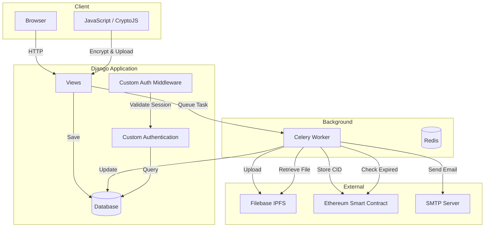
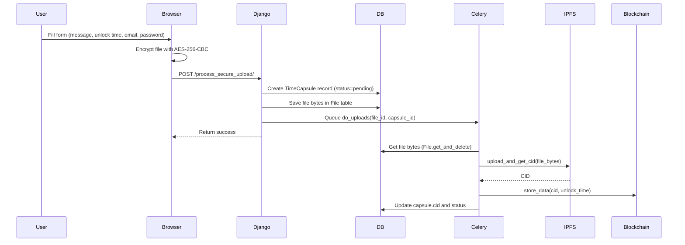
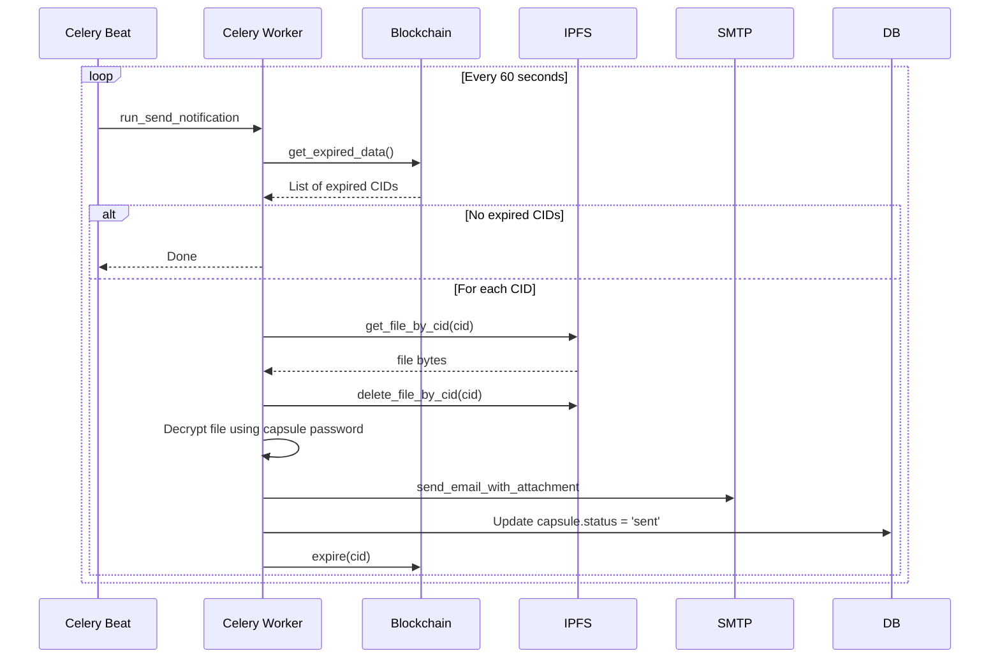
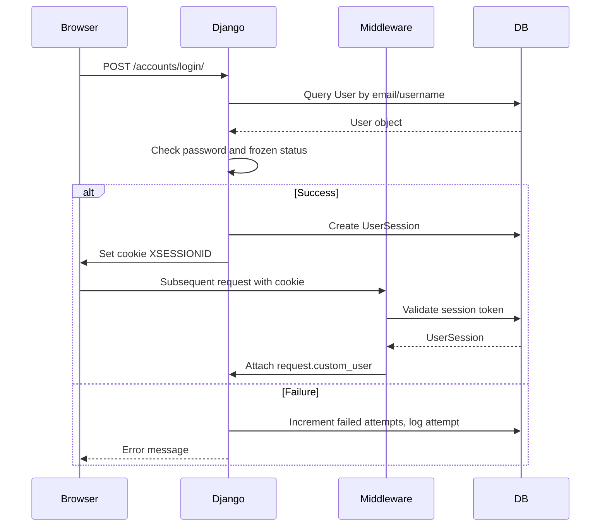
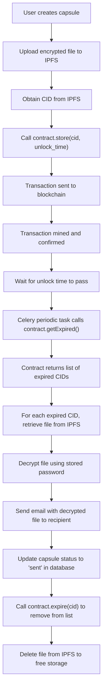
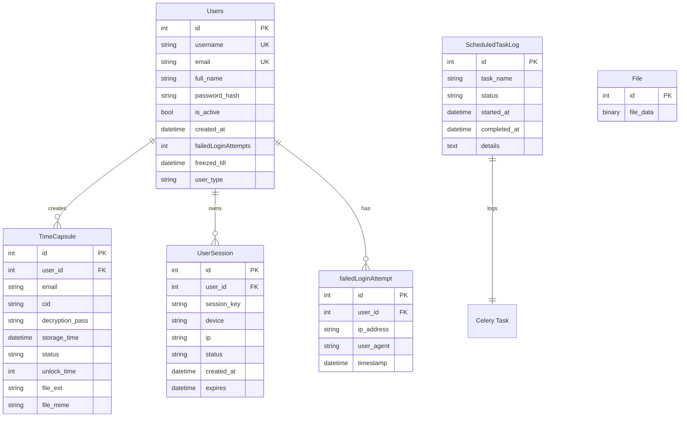

# ECHOME – Time Capsule Messaging System

## 1. Project Overview

ECHOME is a web application that allows users to create encrypted “time capsules” – messages (text or audio) that are securely stored and automatically delivered to a recipient’s email at a future date. The system uses blockchain technology to enforce the release time, IPFS for decentralized file storage, and a Celery task queue for background processing.

### Key Features

- **End‑to‑end encryption**: Files are encrypted client‑side using AES‑256‑CBC; the server never sees the plaintext.
- **Time‑locked delivery**: A smart contract stores the file’s CID and the unlock delay; delivery is triggered only after the specified time has passed.
- **Decentralized storage**: Files are stored on IPFS via Filebase.
- **Email notifications**: When a capsule expires, the decrypted file is emailed to the recipient.
- **Custom authentication**: Cookie‑based session management with brute‑force protection.

---

## 2. Technology Stack

| Component           | Technology / Service                               |
|---------------------|----------------------------------------------------|
| Backend Framework   | Django 4.2                                         |
| Database            | SQLite (development), PostgreSQL (production)      |
| Task Queue          | Celery + Redis (broker/backend)                    |
| Blockchain          | Ethereum (Sepolia testnet or SKALE)                |
| Smart Contract      | Solidity 0.8.x, deployed via `web3.py`             |
| IPFS Storage        | Filebase (S3‑compatible IPFS)                      |
| Frontend            | HTML, CSS, JavaScript (CryptoJS for encryption)    |
| Email               | Gmail SMTP (with SSL)                              |
| Logging             | Python `logging` module (console + file)           |
| Authentication      | Custom user model + custom session middleware      |

---

## 3. System Architecture

---

#  4. Workflows Diagrams 

---

## 4.1 Time Capsule Creation 

---
## 4.2  Time Capsule Delivery (Expiration Check)

---

## 4.3 User Authentication Flow

---
## 4.4 Blockchain Interaction Lifecycle

---

# Database Models (ER Diagram)

---

